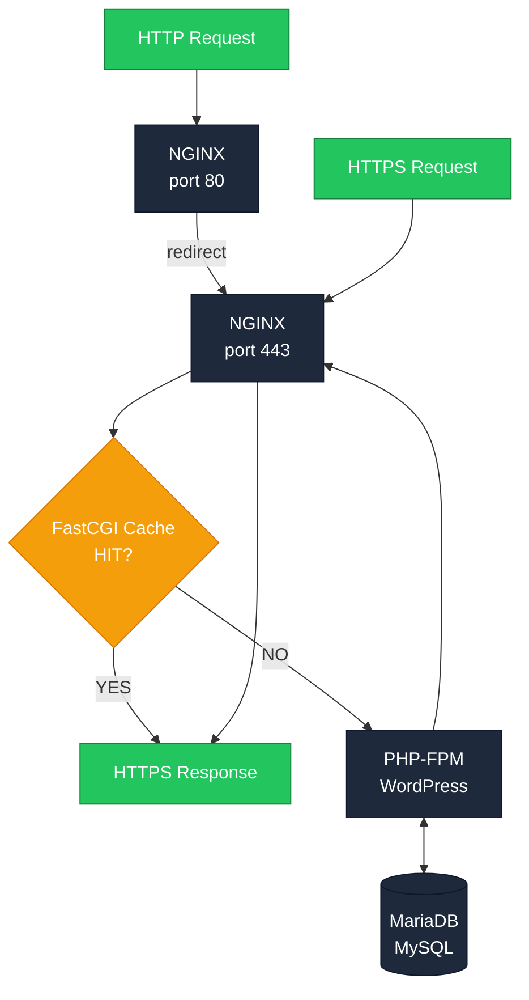

# FastCGI Cache

FastCGI Cache slaat de output van PHP-pagina's op zodat herhaalde requests direct vanaf NGINX worden geserveerd, zonder PHP of database opnieuw aan te roepen.

## Hoe het werkt

## De flow uitgelegd

1. **HTTP requests** komen binnen op NGINX poort 80 en worden direct geredirect naar HTTPS.
2. **HTTPS requests** worden afgehandeld door NGINX op poort 443.
3. NGINX checkt of de pagina al **gecached** is in FastCGI Cache:
   - **HIT** → de gecachte response wordt direct teruggestuurd. Snel, geen PHP nodig.
   - **MISS** → de request gaat door naar PHP-FPM, die WordPress draait en eventueel de database raadpleegt.
4. De gegenereerde response wordt via NGINX teruggestuurd én gecached voor volgende requests.

::: tip Waarom is dit snel?
Een cache HIT levert pagina's binnen milliseconden — geen PHP execution, geen database queries. Voor sites met hoge traffic kan dit het verschil zijn tussen een trage en een razendsnelle ervaring.
:::

 

## FastCGI Cache inschakelen

1. Ga naar **Ontwikkelaarstools**.
2. Gebruik in het onderdeel **NGINX** de schakelaar om FastCGI Cache in te schakelen.

> Heb je meerdere domeinen? Selecteer dan eerst het juiste domein in het dropdown-menu.

 

We raden af om FastCGI Cache in te schakelen terwijl je nog aan je website werkt — bijgewerkte content kan dan namelijk blijven worden uitgeleverd vanuit de cache. Gebeurt dit toch? Dan kun je de <b>cache leegmaken</b> zodat NGINX een nieuwe versie genereert met je laatste wijzigingen.

